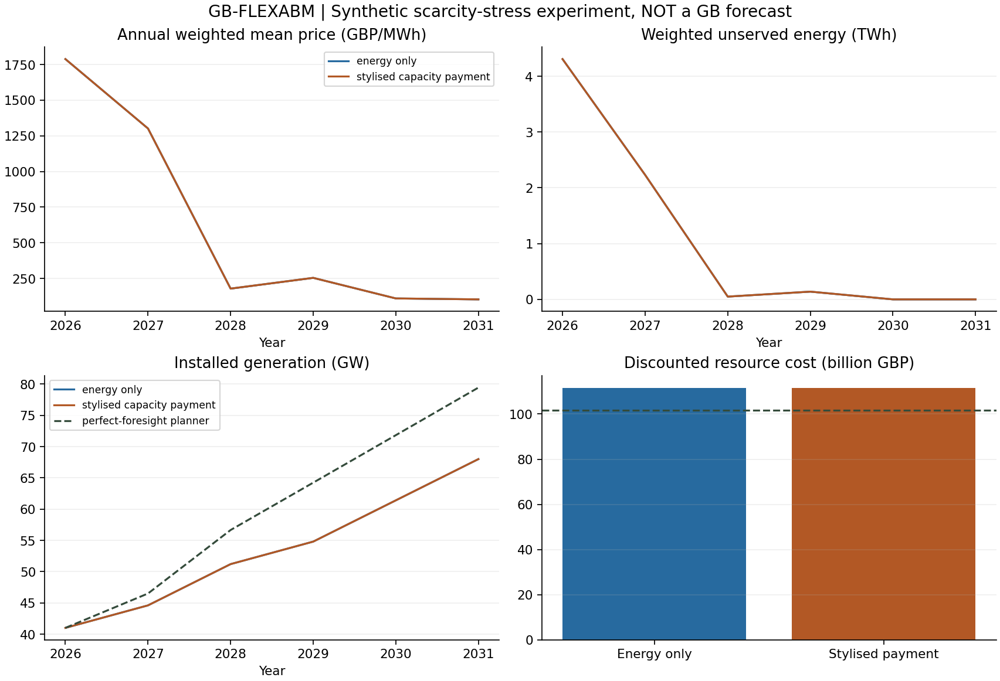

# Synthetic market-design experiment

Scientific status: exploratory, uncalibrated; not a forecast or a welfare estimate for Great Britain.

Paired seeds: 20. Shading in the figure is the empirical 10th–90th percentile across these seeds, not a calibrated prediction interval.

Mean resource-NPV difference (stylised payment minus energy-only): 0 GBP.
Empirical difference range: 0 to 0 GBP.

The initial fleet deliberately creates scarcity. High prices and unserved energy are properties of this synthetic stress fixture, not estimates of observed GB conditions.

Capacity payments are investor/consumer transfers and excluded from the resource-cost objective. The planner has perfect foresight and continuous investment; the ABM has bounded expectations, finance budgets and pro-rata project rationing. The gap is conditional on those differences, not a general estimate of market inefficiency.

Storage is fixed exogenously and cyclic within one repeated chronological block. Scarcity hours are deterministic weighted hours, not Monte Carlo LOLE. No official Capacity Market auction, CfD, heat or hydrogen behaviour is represented.

## Evidence

- `summary.csv`: paired system costs and verification gap.
- `annual.csv`: capacities, weighted energy, prices, emissions and transfers.
- `decisions.csv`, `settlements.csv`, `assets.csv`: investment/vintage/accounting trace.
- `planner_annual.csv`, `planner_builds.csv`: normative benchmark.
- `dispatch_reference.csv`: first-year shared physical reference.
- `manifest.json`: code, dependency, config, seed and output hashes.

